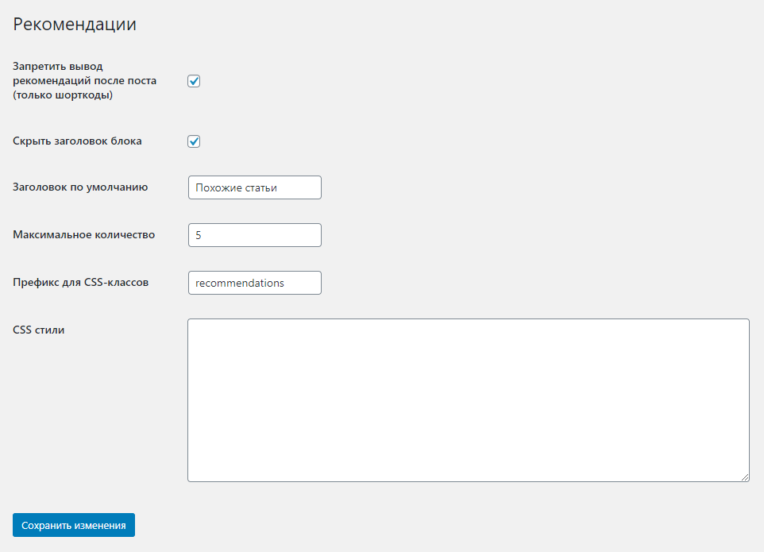

# WordPress плагин Рекоммендации

Выводит блок с рекомендованными ссылками после текста поста/страницы.

## Глобальные настройки плагина

Найдите пункт `Настройки` -> `Рекомендации` в меню WordPress:


Страница настроек плагина:



* Запретить вывод рекомендаций после поста (только шорткоды) - запрещает добавление блока рекомендаций после текста поста
* Скрыть заголовок блока - убирает заголовок `Похожие статьи`.
* Заголовок по умолчанию - текст заголовка по умолчанию (`Похожие статьи`).
* Максимальное количество - ограничивает количество выводимых ссылок
* Префикс для CSS-классов - префикс для имен классов.
  * `.{prefix}` - основной контейнер
  * `.{prefix}__title` - заголовок
  * `.{prefix}__list` - список ссылок (тег `ul`)
  * `.{prefix}__item` - пункт списка (тег `li`)
* CSS стили - кастомные стили для блока. Выводятся в секции `head` на странице post/page, если включена генерация Рекомендаций.

## Настройки для отдельного поста/страницы

Включите отоборажение метабокса на странице поста:


Метабокс с настройками плагина:


* Показать рекомендации - включает генерацию блока Рекомендации после текста поста.
* Заголовок блока - заголовок блока рекомендаций. По умолчанию `Похожие статьи`. Отключить заголовок можно на странице глобальных настроек плагина.
* Список рекомендаций - список ссылок
  * Ссылка - URL-адрес
  * Текст ссылки
* Рекомендовать теги - включить в список рекомендаций посты по выбранным тегам (подбираются автоматически).

## Шортокод

```
[recommendations id="POST_ID"]
```

* `POST_ID` - идентификатор поста/страницы, для которой нужно сгенерировать блок рекоммендаций
